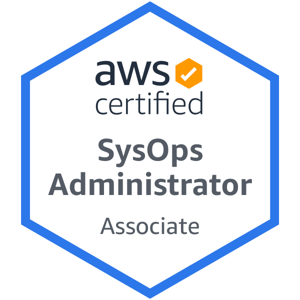

### Hi there 👋

My name is Bryan, I'm currently working remotely as Devops Engineer, I'm always trying to learn some edge technologies, I also have experience as a fullstack developer, here are some of my skills:

- AWS
- Terraform
- Kubernetes
- Docker
- PHP
- Python
- Javascript
- Java
- Linux
- Jenkins
- Git
- SQL

📫 How to reach me: bryan.rhm1@gmail.com / [Linkedin](https://www.linkedin.com/in/bryan-recinos-16a481159/)

Certifications:

